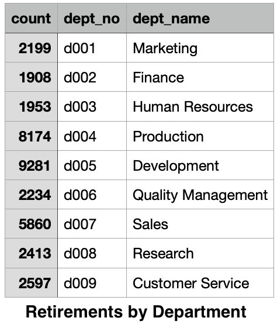
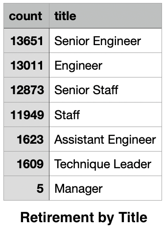

# Pewlett-Hackard-Analysis
## Analysis Overview ##
The primary aim of this analysis was to inform the Pewlett-Hackard company of its needs as it approaches a period of significant transition. Transitions can make or break a company, or at the least, easily redefine it. Whether these transitions look like turnover (in PH's case due to wide scale retirements), mergers, being bought, sold or rebranding, they are often tumultuous. This analysis aims to inform PH higher ups on how to ride this wave by providing the following insights.
1. Clarify the scope of upcoming retirements with realistic projections
2. Identify the roles that will be left most vacant
3. Identify veteran employees for potential mentorships 
4. Clarify potential memberships by department in order to reorient the company and initiate a new generation of employees in the Pewlett-Hackard company.    
## Results ##
With many thousands of employees set to hit retirement age this year, two key needs are clear: 
* PH will need a huge amount of new talent
* PH will need to actualize the experience and branding inherent within their veteran employees.  
The aforementioned 4 insights of this analysis stem from these keys. 

### Item 1: Clarifying the Scope of Retirements ###
Nothing is more daunting than a problem unknown. Below is a figure taken from this analysis’s retirements_by_department.csv file. In it we clarify which departments will be hit hardest and by how much.  

  

 
We see that the top 3 departments hit hardest in order of magnitude are *Development, Production, and Sales*.  

### 2. Identify the roles that will be left most vacant ###
Knowing which departments need staffing is a critical insight as PH plans for the next phase. However, it is also important to translate this void into more specific positions for which replacements can be sought today. To do this, the analysis provides the following figure depicting which roles will have vacancies in the upcoming retirements.  

  

 
True enough to the previous insight, the most vacant positions that will need to be filled through promotion or new talent are in order of magnitude *Senior Engineers*, mid level *Engineers*, and *Senior Staff* leadership positions.  
For additional basic information regarding retiring employees and their titles, etc., see the retirement_titles.csv file. 
